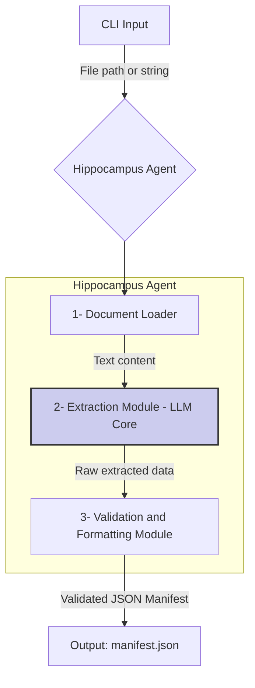

# **Technical Design Document: "Hippocampus" Agent**

**Version:** 2.0

**Author:** Maicon de Menezes

**Date:** September 18, 2025

## **1. Overview and Mission**

The "Hippocampus" agent is a command-line interface (CLI) tool designed for the rapid acquisition and indexing of knowledge from text documents. Its mission is to receive a document (via file path or text string), extract essential metadata and references using an LLM pipeline, and generate a structured data "manifest," preparing the ground for asynchronous downstream processing.

The application operates as a focused AI agent, utilizing LLMops tools like LangChain/LangGraph to orchestrate extraction and formatting tasks, ensuring a consistent and well-defined output.

## **2. High-Level Architecture and Execution Flow**

The architecture is centered on a pipeline orchestrated by LangGraph, invoked through a CLI. This flow ensures that each document robustly and modularly passes through loading, analysis, and formatting stages.



## **3. Components and Separation of Responsibilities**

* **CLI Interface:**

  * **Responsibility:** The application's entry point. It accepts a file path (`-f/--file`) or a text string (`-t/--text`) as an argument. Manages the initial user interaction.

* **Document Loader (LangChain Loader):**

  * **Responsibility:** Handles the diversity of input document types (md, txt, pdf, tex, etc.). Its sole function is to read the source file and convert it into a clean, plain text format, ready to be processed.

* **Extraction Module (LLM Core / LangGraph Agent):**

  * **Responsibility:** The brain of the application. It orchestrates a deep scan of the text by utilizing predefined prompts and templates in an LLM pipeline. Its mission is to **identify, extract, and catalog all forms of external references and knowledge sources** within the document. This includes, but is not limited to:
    * **Formal Bibliographic References:** Items found in explicit "Bibliography" or "References" sections.
    * **In-Text Citations:** Mentions of authors, studies, or sources that appear within the text flow (e.g., "as Fuster (2003) demonstrated...").
    * **Web Links (Hyperlinks):** URLs found in the document.
    * **Footnotes and Endnotes:** Sources cited in notes.

    The agent is designed to find these references opportunistically, even without a formal bibliographic list. Each extracted reference is then cataloged with essential metadata, such as its **`type`** (e.g., `journal article`, `book`, `web link`) and its **`origin`** (e.g., `bibliography section`, `in-text citation`), to enrich the final manifest and guide the consolidation process.

* **Validation and Formatting Module:**

  * **Responsibility:** Receives the (potentially inconsistent) output from the LLM. Its function is to validate, clean, and format this data to ensure it perfectly fits the `manifest.json` data contract. It enforces the correct structure and data types.

## **4. Output Contract and Data Model (`manifest.json`)**

The "Hippocampus" agent **produces** an artifact (`manifest.json`) that adheres to a strict data contract. This is its main shared responsibility with the "Consolidation System."

* **Output Entity:**

  ```mermaid
  erDiagram
      Manifest {
          string manifestVersion PK
          string manifestId
          datetime processedAt
          string status "'Awaiting Consolidation' (Fixed Value)"
          json sourceDocument
          json knowledgeIndex
      }
  ```

* **Detailed Contract Schema (`manifest.json`):**

    To accommodate the diversity of sources, we introduce a polymorphic structure. Each reference object will have a set of **common properties** and a **`details`** object whose structure varies according to the `referenceType`.

    **1. Common Properties (Required for all references):**

| Property | Type | Description | Example |
| :--- | :--- | :--- | :--- |
| `id` | integer | A unique sequential identifier within the manifest. | `1` |
| `rawString` | string | The exact text of the reference as found in the document. | `"Squire, L. R. (1991). Science, 253(5026)"` |
| `referenceType` | string | The conceptual type of the source. | `"scientific_article"`, `"book"`, `"youtube_video"` |
| `sourceFormat` | string | The technical format of the source file or content. | `"pdf"`, `"web_content"`, `"video"` |
| `sourcePath` | string | The path to the resource (URL or future file path). | `"https://doi.org/10.1126/science.1893226"` |
| `details` | object | An object containing fields specific to the `referenceType`. | `{ "doi": "...", "journal": "..." }` |

**2. Examples of `details` Object Structures:**

The beauty of this design lies in the flexibility of the `details` field.

* **If `referenceType` is `"scientific_article"`:**

    ```json
    "details": {
      "title": "The medial temporal lobe memory system",
      "authors": ["Squire, L. R.", "Zola-Morgan, S."],
      "year": 1991,
      "journal": "Science",
      "doi": "10.1126/science.1893226"
    }
    ```

* **If `referenceType` is `"youtube_video"`:**

    ```json
    "details": {
      "title": "How does your memory work?",
      "channelName": "Kurzgesagt – In a Nutshell",
      "videoId": "UBVV8pch1dM",
      "uploadDate": "2022-07-28"
    }
    ```

* **If `referenceType` is `"official_documentation"`:**

    ```json
    "details": {
      "product": "LangGraph",
      "pageTitle": "Getting Started: Building an agent",
      "version": "0.1.0"
    }
    ```

* **If `referenceType` is `"blog_post"`:**

    ```json
    "details": {
      "title": "Why the Hippocampus is the Brain's Indexer",
      "author": "Dr. Synapse",
      "blogName": "The Neural Network",
      "publicationDate": "2024-05-20"
    }
    ```

## **5. Technical Requirements and Stack**

* **Interface:** CLI (Command-Line Interface).
* **LLM Orchestration:** LangChain, LangGraph.
* **Computation Guides:** Prompts and Templates.
* **Supported Input Formats:** Plain text (`.txt`, `.md`), PDF (`.pdf`), LaTeX (`.tex`), and other text-based formats supported by LangChain loaders.

## **6. Implementation Plan**

### 6.1 Guiding Principles (from biblio-agent learnings)

* Strict separation: domain contracts vs infrastructure implementations.
* Absolute imports, minimal `__init__.py`, single-responsibility modules.
* CLI as a thin layer delegating to application pipelines.
* Deterministic outputs with explicit validation against schemas.
* Graceful degradation: feature flags and stubs when LLM/graph not configured.

### 6.2 Phased Delivery Roadmap

1. Foundation and Scaffolding

* Repo setup: `hippocampus/` with `core/{application,cli,domain,infrastructure,noesis}`.
* Packaging: `[project].name = "hippocampus"`, entrypoint `hippo = core.cli.root:main`.
* Contracts: define `Manifest` schema (Pydantic or TypedDict) and `Loader`, `Extractor`, `Formatter` interfaces in `core/domain`.
* Templates/Prompts: seed directories `prompts/` and `templates/` with placeholders.
* Acceptance: project builds, `hippo --help` runs, schema module importable.

1. Minimal Viable Pipeline (Text only)

* CLI root: flags `-t/--text`, `-f/--file` (file later), `-o/--output`.
* Document Loader: plain text passthrough; file path read with UTF-8, newline normalization.
* Extraction Module (LLM stub): deterministic heuristic extracting URLs and simple citation patterns; log structure matching `manifest.json`.
* Validation/Formatting: implement schema validation and emit `manifest.json` with `status = "Awaiting Consolidation"` and metadata (`manifestId`, `processedAt`).
* Acceptance: run with short text; generates `manifest.json` matching schema; unit tests for schema/loader.

1. File Inputs and Multiformat Loading

* Integrate LangChain loaders for `.md`, `.txt`; add optional PDF via `pypdf` if available; LaTeX via simple stripping.
* Unified loader interface returning normalized plain text + source metadata.
* Acceptance: sample files produce identical content to direct text input (modulo whitespace).

1. LLM-Orchestrated Extraction (LangGraph introduction)

* Introduce `core/noesis/graph` with a small LangGraph orchestrator: nodes for classify → extract → consolidate.
* Prompts library in `prompts/`; versioned templates.
* Configurable LLM (env var or flag); fallback to heuristic when not configured.
* Acceptance: with LLM configured, extraction enriches `details` per `referenceType`.

1. Robust Validation and Schema Evolution

* Lock `manifest.schema.json` in repo; add JSON Schema validation on output.
* Add polymorphic `details` validators per `referenceType`.
* Migration notes and versioning (`manifestVersion`).
* Acceptance: invalid outputs fail with actionable errors; tests cover representative types.

1. DX, Logging, and Observability

* Structured logging with `rich` or `loguru`; `--verbose` flag.
* Deterministic seeds for LLM calls where supported; request/response traces gated by env.
* Acceptance: logs show stages and timings; CI runs lint + tests.

1. Packaging and Distribution (Phase 8)

* Instalação completa (sem extras): todas as dependências ficam em `[project].dependencies`.
* Artefatos: gerar wheel e sdist; incluir `core/resources/**` (schemas, prompts, templates).
* CI: job de build + smoke (`pip install dist/*.whl`, `hippo --help`, coleta heurística curta).
* Release: anexar artefatos no GitHub Release; publicação em PyPI opcional/condicional.
* Documentação: README com instruções de instalação (pip/uv), requisitos (Python >= 3.11).
* Aceite: `pip install .` fornece `hippo`; recursos e schema acessíveis em runtime.

### 6.7 Documentation Strategy (User vs Technical)

* User Documentation (MkDocs + Material):
  * Objetivo: documentação de uso do CLI para usuários finais.
  * Stack: `mkdocs` com tema Material (versão mais recente), `docs_dir: docs-user/`.
  * Estrutura recomendada: `index.md` (Getting Started), `installation.md`, `usage.md`, `cli.md`, `configuration.md`, `troubleshooting.md`.
  * Publicação: GitHub Pages via workflow; URL adicionada em `project.urls` do `pyproject.toml` para exibição no PyPI.
* Technical Documentation (in-repo):
  * Objetivo: documentação de projeto e desenvolvimento (interna ao repositório).
  * Local: `docs/` (design_doc.md, BACKLOG.md, TODO.md, arquitetura, decisões, etc.).
  * Entrada: `README.md` conterá seção "Documentação Técnica" com links para os artefatos internos.
* Critérios de Aceite:
  * Site do MkDocs acessível e publicado a partir da branch default ou `gh-pages`.
  * Links no `README.md` e `pyproject.toml` (project-urls) apontam para a documentação pública.
  * Artefatos técnicos permanecem versionados no repo e navegáveis via README.

### 6.3 Detailed Work Breakdown

* Domain
  * `core/domain/manifest.py`: data classes/TypedDicts for Manifest, Reference, Details variants; constants for status/version.
  * `core/domain/interfaces.py`: `DocumentLoader`, `ExtractionAgent`, `Formatter` contracts.

* Application
  * `core/application/pipeline.py`: `build_manifest_from_text|file` orchestration; I/O discipline; error mapping.
  * `core/application/validation.py`: schema validation utilities.

* CLI
  * `core/cli/root.py`: parse arguments; delegate to application; print output path.

* Infrastructure
  * `core/infrastructure/loaders/`: text, markdown, generic loader registry.
  * `core/infrastructure/extraction/`: heuristic extractor; later LangGraph-backed agent.
  * `core/infrastructure/formatters/`: JSON writer for manifest; date/id utils.

* Noesis (LangGraph)
  * `core/noesis/graph/agent.py`: minimal graph; nodes and edges; config plumbing.

### 6.4 Acceptance Criteria per Phase

* Clear CLI help; errors with non-zero exit; descriptive messages.
* `manifest.json` always includes: `manifestVersion`, `manifestId`, `processedAt`, `status`, `sourceDocument`, `knowledgeIndex`.
* Tests: unit for domain schema, loader behavior, and validation; integration for end-to-end text path.

### 6.5 Risks and Mitigations

* LLM variability: mitigate via deterministic heuristics fallback and prompt tests.
* Loader fragility (PDF/LaTeX): provide optional extras; degrade to text-only if libs missing.
* Scope creep: enforce phase boundaries; freeze schema before LLM integration.

### 6.6 Operational Playbook

* Config via env vars: `HIPPO_MODEL`, `HIPPO_TIMEOUT`, `HIPPO_VERBOSE`.
* Directory convention: when `-o DIR` is provided, write to `DIR/manifest/manifest.json`. Without `-o`, write to `~/.brain-model/hippocampus/buffer/consolidation/manifest/manifest_YYYYMMDD_<id5>.json`.
* Versioning: bump `manifestVersion` on breaking changes; maintain migration notes.
